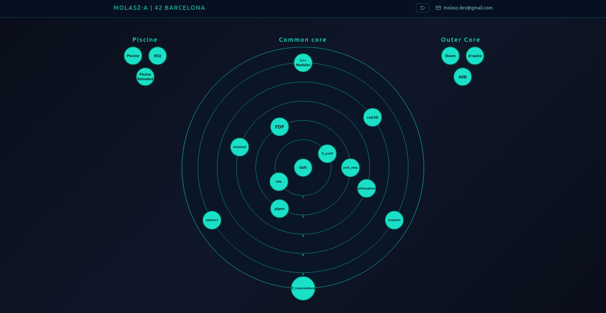

# 42 Barcelona — molasz-a

<div align="center">

<a href="https://molasz.github.io/42-graph/" target="_blank">
  
</a>

**[→ Interactive Project Map ←](https://molasz.github.io/42-graph/)**

</div>

---

42 is a global network of schools born in Paris in 2013. The curriculum covers systems programming, algorithms, networking and full-stack development through a progression of increasingly complex projects — from low-level C to infrastructure and beyond.
This repo centralizes every project I've completed at 42 Barcelona, organized as Git submodules.

---

## 🗂️ Projects


### Piscine

| Project                                                         | Description                                                         |
| --------------------------------------------------------------- | ------------------------------------------------------------------- |
| [Piscine](https://github.com/Molasz/42Piscine)                  | 4-week intensive C bootcamp. Algorithms, memory, Unix fundamentals. |
| [Piscine Reloaded](https://github.com/Molasz/42PiscineReloaded) | Reinforcement round — optimization and best practices.              |
| [BSQ](https://github.com/photocatalysta/42-Piscine-BSQ-Project) | Largest square in a grid. Dynamic programming + file parsing.       |

### Common Core

| Project                                                                 | Rank |         Stack          | Description                                                    |
| ----------------------------------------------------------------------- | :--: | :--------------------: | -------------------------------------------------------------- |
| [libft](https://github.com/Molasz/42cursus-libft)                       | `0`  |          `C`           | C standard library reimplemented from scratch.                 |
| [ft_printf](https://github.com/Molasz/42cursus-ft_printf)               | `1`  |          `C`           | `printf` with variadic functions, flags and precision.         |
| [get_next_line](https://github.com/Molasz/42cursus-get_next_line)       | `1`  |          `C`           | Read any file descriptor one line at a time.                   |
| [push_swap](https://github.com/Molasz/42cursus-push_swap)               | `2`  |          `C`           | Sort a stack of integers in minimum operations.                |
| [pipex](https://github.com/Molasz/42cursus-pipex)                       | `2`  |          `C`           | Shell pipes via `fork`, `execve` and fd redirection.           |
| [FDF](https://github.com/Molasz/42cursus-fdf)                           | `2`  |     `C · MiniLibX`     | Isometric 3D wireframe renderer from elevation maps.           |
| [philosophers](https://github.com/Molasz/42cursus-philosophers)         | `3`  |          `C`           | Dining philosophers — threads, mutexes, no deadlocks.          |
| [minishell](https://github.com/Molasz/42cursus-minishell)               | `3`  |          `C`           | Fully functional Unix shell with pipes, heredocs and builtins. |
| [cub3D](https://github.com/Molasz/42cursus-cub3d)                       | `4`  |      `C · MLX42`       | Raycasting engine inspired by Wolfenstein 3D.                  |
| [C++ Modules](https://github.com/Molasz/42cursus-cpp_modules)           | `5`  |        `C++98`         | 10 modules — OOP, polymorphism, templates, STL, exceptions.    |
| [Inception](https://github.com/Molasz/42cursus-inception)               | `5`  |        `Docker`        | NGINX + WordPress + MariaDB. No pre-built images.              |
| [webserv](https://github.com/Molasz/42cursus-webserv)                   | `5`  |         `C++`          | HTTP/1.1 server — virtual hosts, CGI, non-blocking I/O.        |
| [ft_transcendence](https://github.com/Molasz/42cursus-ft_transcendence) | `6`  | `Django · JS · Docker` | Full-stack Pong — WebSockets, JWT, 2FA, OAuth, 3D.             |

### Outer Core

| Project                                                |     Stack      | Description                                                  |
| ------------------------------------------------------ | :------------: | ------------------------------------------------------------ |
| [libasm](https://github.com/Molasz/42outer-libasm)     |  `x86-64 ASM`  | Core C functions reimplemented in assembly.                  |
| [dr-quine](https://github.com/Molasz/42outer-dr-quine) | `C · ASM · JS` | Self-replicating programs that output their own source code. |
| [nm](https://github.com/Molasz/42outer-nm)             |      `C`       | `nm` reimplemented — ELF parsing and symbol tables.          |

## ⚙️ Usage

```bash
# Clone with all submodules
git clone --recursive https://github.com/Molasz/42.git

# Or, if already cloned
git submodule update --init --recursive
```

---

_molasz-a · 42 Barcelona_
