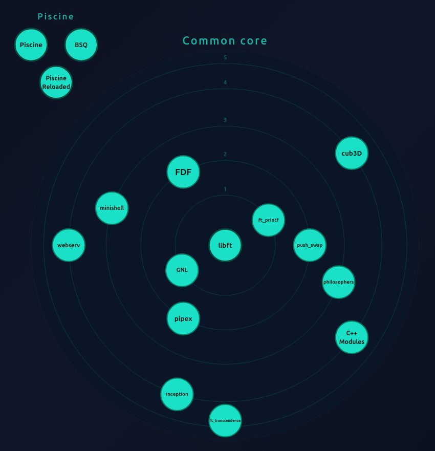

# Mapa de Proyectos 42

# 42 Barcelona — molasz-a

[Ir a la página principal](index.html)

# 42 Barcelona — molasz-a

Welcome to my 42 Common Core journey. This repository serves as a central hub for all the projects I have completed at 42 Barcelona, organized via Git submodules.

## 💡 About 42 Network

42 is a global, tuition-free computer science school that originated in Paris in 2013 to disrupt traditional education. It operates without teachers, classrooms, or textbooks. Instead, it relies on a 100% Peer-to-Peer learning model where students are responsible for their own success and the evaluation of their peers.
The Methodology:

- Project-Based Learning: The curriculum consists of increasingly complex technical challenges that must be solved from scratch.

- Gamification: Progress is tracked through "levels" and "ranks," mirroring a skill tree in a video game.

- The Piscine: Every student's journey begins with the "Piscine," a 4-week intensive C programming bootcamp to test logic and resilience.

- Common Core: After the Piscine, students enter the Common Core, a rigorous path covering everything from Unix logic and algorithms to systems administration and web development.

## 🌐 Interactive Project Map

<a href="https://molasz.github.io/42/" target="_blank">
    <div style="display: flex; align-items: center; flex-direction: column">
        <strong>View Interactive Project Map</strong>
		
    </div>
</a>

---

### 🗺️ Projects

The following projects represent the curriculum's progression, focusing on C, C++, and infrastructure.

<div align="center">

| **Proyecto**         | **Nivel** | **Descripción**                                                                                                                                                        |
| -------------------- | :-------: | :--------------------------------------------------------------------------------------------------------------------------------------------------------------------- |
| **Piscine**          |  Piscine  | Intensive 4-week bootcamp covering C, algorithms, memory management and Unix fundamentals — the foundation of the 42 curriculum.                                       |
| **Piscine Reloaded** |  Piscine  | Review of the Piscine with additional exercises, focusing on optimization and best practices — essential reinforcement before the projects.                            |
| **BSQ**              |  Piscine  | The classic 'Biggest Square' problem — find the largest square in a grid with obstacles, using dynamic programming and efficient file parsing.                         |
| **libft**            |     0     | Re-implement the C standard library from scratch — the backbone of every project that follows.                                                                         |
| **ft_printf**        |     1     | Re-implementation of printf using variadic functions — flags, width, precision and justification.                                                                      |
| **get_next_line**    |     1     | Read any file descriptor one line at a time with a configurable BUFFER_SIZE.                                                                                           |
| **push_swap**        |     2     | Sort a stack of integers using only two stacks and a minimum number of operations.                                                                                     |
| **pipex**            |     2     | Recreate shell pipes using fork, execve and file descriptor redirection.                                                                                               |
| **FDF**              |     2     | 3D wireframe terrain renderer — read elevation maps and project them in isometric 3D using MiniLibX.                                                                   |
| **philosophers**     |     3     | The Dining Philosophers problem — threads, mutexes and deadlock prevention in C.                                                                                       |
| **minishell**        |     3     | A fully functional Unix shell with pipes, redirections, heredocs, variable expansion and all builtins.                                                                 |
| **cub3D**            |     4     | Raycasting engine inspired by Wolfenstein 3D — DDA algorithm, textures, minimap, built with MLX42.                                                                     |
| **C++ Modules**      |     4     | 10 modules covering C++98 OOP: Orthodox Canonical Form, polymorphism, templates, STL and exceptions.                                                                   |
| **Inception**        |     4     | Docker infrastructure from scratch: NGINX + WordPress + MariaDB, persistent volumes, no pre-built images.                                                              |
| **webserv**          |     4     | HTTP/1.1 web server in C++ with config files, virtual hosts, CGI and non-blocking I/O.                                                                                 |
| **ft_transcendence** |     5     | Full-stack Pong platform: Django + PostgreSQL + Vanilla JS + Docker. WebSockets, JWT, 2FA, OAuth and 3D rendering.                                                     |
| **libasm**           |     4     | Re-implement core C functions in x86-64 assembly — ft_strlen, ft_strcpy, ft_strcmp, ft_write, ft_read, ft_strdup. Learn low-level programming and calling conventions. |
| **dr-quine**         |     4     | Create self-replicating programs (quines) in C — programs that output their own source code. Explore code generation and self-reference.                               |
| **nm**               |     4     | Re-implement the nm command — display symbol table of object files. Parse ELF format, handle symbols, types and values.                                                |

</div>

---

## 🛠️ Usage

To clone this repository along with all project submodules:

```bash
git clone --recursive https://github.com/Molasz/42.git
```

If you have already cloned it, you can initialize the submodules with:

```bash
git submodule update --init --recursive
```

---

_Created by molasz-a (42 Barcelona)_
